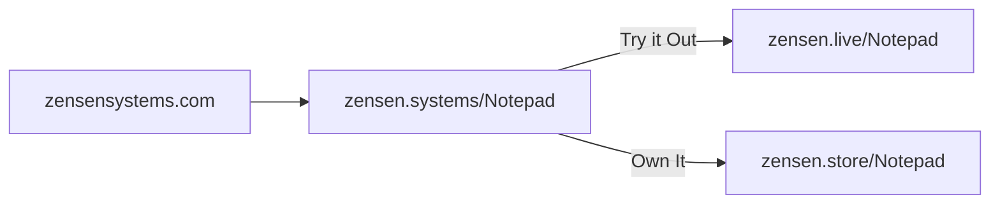

# ZENS3N Atlas · Sitemap

One map for the ZENS3N suite, public surfaces, runtime families, source
boundaries, and unresolved relationships.

**Face:** [`../../../loom.html`](../../../loom.html) reads this file (`Sitemap.md`). Do not fork a second graph in the loom.

## Authority map

| Authority | Owns | Does not own |
|---|---|---|
| `../../../suite-manifest.json` | 21-node suite graph, batches, ports, states, source bindings | explanatory architecture |
| `../../../` | executable website, satellite source, deployment verifiers | ecosystem-wide canon |
| `../../../../!WORKDESK/Projects/Atlas/` | public-site Looms, launch gates, rehearsals | suite-node graph |
| `../../../../ZEN.HUB/` | provider references, specs, patterns, runbooks | project implementation truth |
| `../../../../_TRON/` | runtime agents, services, stations, and system generation | public-site state |
| `../../../../../!7HE.BRIDGE/7HE.CITADEL/!CORE.MEM/` | durable contracts and canon | live provider state |
| Railway and public endpoints | current deployed behavior | design intent or local source truth |

Atlas binds these authorities. It does not replace them.

## Public domain roles (locked)

| Domain | Job | First content |
|---|---|---|
| `zensensystems.com` | Company home | Suite `index.html` |
| `zensen.systems` | Educate / product catalog | `/Notepad` |
| `zensen.live` | Try / demo runtime | `/Notepad` demo |
| `zensen.store` | Own / buy | `/Notepad` offer |
| `zensen.solutions` | Hire / accept work | Intake |
| `zensenenterprises.com` | Long-term | card-only |

## Notepad product path



Template for every future product: educate on `.systems` → Try on `.live` → Own on `.store`.

## Suite shape

```mermaid
flowchart TD
    SUITE[ZENSEN SYSTEM SUITE · 6060]

    SUITE --> ZS[ZENSEN SITES]
    SUITE --> OX[3OX]
    SUITE --> AG[ÆGEN]
    SUITE --> CT[CONTROL]
    SUITE --> SO[STRATA-OP]
    SUITE --> CO[CMD-OPS]

    ZS --> LIVE[zensen.live · try · 6061]
    ZS --> SOL[zensen.solutions · hire · 6062]
    ZS --> SYS[zensen.systems · educate · 6063]
    ZS --> STORE[zensen.store · own · 6064]
    ZS --> ENT[zensenenterprises.com · later · 6066]

    OX --> STUDIO[3ox.studio · 6050]
    OX --> AI[3ox.ai · 6051]
    OX --> OSTORE[3ox.store · 6052]

    AG --> AEGEN[ÆGen]
    AG --> AEGIS[ÆGIS]
    AG --> TAU[ÆGen τ]

    CT --> ORION[ORION]
    CT --> WARDEN[WARDEN]
    CT --> LEDGER[LEDG3R]

    SO --> ONE[1N3OX]
    SO --> ZENDEX[ZENDEX]
    SO --> WRKDSK[WRKDSK]

    CO --> CMD[CMD]
    CO --> TELE[TELEPROMPTR]
    CO --> ARGOS[ArgOS]
```



Every non-hub node currently points back to the suite through the Railway
private-network reference. That is a declared graph contract, not proof that
all nodes have deployed services.

## Filesystem layer 1 · suite roots

This is the first filesystem layer only: immediate child folders of the
suite-named roots discovered under `!LAUNCHPAD`. Deeper contents remain
unmapped until the next layer is explicitly added.

| Suite root | Immediate child folders |
|---|---|
| `!7HE.BRIDGE/7HE.CITADEL/!CORE.MEM/!ZENSUITE` | `3OX`, `AEGIS`, `BIOS`, `CENTRAL`, `CITADEL`, `FORGE`, `HALO`, `METATRON`, `MONAD`, `NOMOS`, `OBSIDIA`, `ORION`, `RAVEN`, `VEC3`, `ZENSEN`, `[CMD]`, `[DROP]`, `_meta`, `Æ` |
| `!7HE.BRIDGE/7HE.CITADEL/!CORE.MEM/_CANON/Zensen.Suite` | *(no child folders)* |
| `!7HE.BRIDGE/7HE.CITADEL/!CORE.MEM/_CANON/ZensenSystems/RingSets/SUITE[13]` | `nodes` |
| `!7HE.BRIDGE/7HE.LIGHTHOUSE/!CORE.MEM/!ZENSUITE` | `3OX`, `AEGIS`, `BIOS`, `CENTRAL`, `CITADEL`, `HALO`, `METATRON` |
| `!7HE.BRIDGE/7HE.LIGHTHOUSE/!CORE.MEM/_CANON/Zensen.Suite` | *(no child folders)* |

## Batch register

| Batch | Nodes | System role | Current implementation state |
|---|---:|---|---|
| `SUITE` | 1 | suite edge and primary map | active staging |
| `ZENSEN-SITES` | 5 | public company surfaces | live/systems/store/solutions scaffolding; enterprises card-only |
| `3OX` | 3 | studio, AI, and store surfaces | studio active; two card-only |
| `ÆGEN` | 3 | runtime, governance, runtime receipt | card-only |
| `CONTROL` | 3 | supervision, policy gate, receipts | card-only |
| `STRATA-OP` | 3 | strata operations, index, workstation | card-only |
| `CMD-OPS` | 3 | command, teleprompt, governor | card-only |

## Node register

| Node | Batch | Role | Port | State | Source boundary |
|---|---|---|---:|---|---|
| `ZENSEN-SYSTEM-SUITE` | SUITE | suite-edge | 6060 | active-staging | repository root |
| `ZENSEN-LIVE` | ZENSEN-SITES | try | 6061 | active-staging | `satellites/zensen.live/` |
| `ZENSEN-SOLUTIONS` | ZENSEN-SITES | hire | 6062 | active-staging | `satellites/zensen.solutions/` |
| `ZENSEN-SYSTEMS` | ZENSEN-SITES | educate | 6063 | active-staging | `satellites/zensen.systems/` |
| `ZENSEN-STORE` | ZENSEN-SITES | own | 6064 | active-staging | `satellites/zensen.store/` |
| `ZENSEN-ENTERPRISES` | ZENSEN-SITES | corporate-later | 6066 | card-only | unbound |
| `3OX-STUDIO` | 3OX | studio | 6050 | active-staging | `satellites/3ox.studio/` |
| `3OX.Ai` | 3OX | ai | 6051 | card-only | unbound |
| `3OX-STORE` | 3OX | store | 6052 | card-only | unbound |
| `ÆGen` | ÆGEN | runtime | — | card-only | unbound |
| `ÆGIS` | ÆGEN | governance | — | card-only | unbound |
| `ÆGen{τ}` | ÆGEN | runtime-receipt | — | card-only | unbound |
| `ORION` | CONTROL | supervision | — | card-only | unbound |
| `WARDEN` | CONTROL | policy-gate | — | card-only | unbound |
| `LEDG3R` | CONTROL | receipts | — | card-only | unbound |
| `1N3OX` | STRATA-OP | strata-ops | — | card-only | unbound |
| `ZENDEX` | STRATA-OP | index | — | card-only | unbound |
| `WRKDSK` | STRATA-OP | workstation | — | card-only | unbound |
| `CMD` | CMD-OPS | command | — | card-only | unbound |
| `TELEPROMPTR` | CMD-OPS | TELPROMPT | — | card-only | unbound |
| `ArgOS` | CMD-OPS | governor | — | card-only | unbound |

## Active surfaces

| Surface | Local | Tailscale | Railway | Public DNS |
|---|---|---|---|---|
| ZENSEN suite (home) | `127.0.0.1:7120` | port `6060` | `zens3n-production.up.railway.app` | not approved |
| zensen.live | `127.0.0.1:6061` | port `6061` | pending deploy | not approved |
| zensen.solutions | `127.0.0.1:6062` | port `6062` | pending deploy | not approved |
| zensen.systems | `127.0.0.1:6063` | port `6063` | pending deploy | not approved |
| zensen.store | `127.0.0.1:6064` | port `6064` | pending deploy | not approved |
| 3OX Studio | port `6050` | port `6050` | `3ox-studio-production.up.railway.app` | not purchased |

The manifest records declarations. Deployment verifiers and live requests prove
current behavior.

## Project boundaries

```text
ZENS3N repository
├── loom.html                 suite loom face (reads Sitemap + manifest)
├── Atlas/_ops/map/           Sitemap.md (map data)
├── [1N]3OX Atlas/            inbox for unfinished fragments
├── suite-manifest.json       authoritative 21-node graph
├── index.html                suite presentation (home)
├── deploy/                   graph and surface verification
├── satellites/zensen.live/   try surface
├── satellites/zensen.systems/ educate surface
├── satellites/zensen.store/  own surface
├── satellites/zensen.solutions/ hire surface
├── satellites/3ox.studio/    source-backed satellite
├── satellites/3ox.ai/        3OX.Ai satellite
└── spec/                     product, market, valuation views

Workdesk Atlas
└── public-site Looms, launch gates, rehearsal, and promotion receipts

ZEN.HUB
└── external provider knowledge converted into reusable local contracts

_TRON + CORE.MEM
└── runtime implementation families and durable architectural authority
```

## Current gates

- Production DNS: not approved (cutover packet after staging green).
- Production VPS: not approved.
- 10,000-user capacity: not approved.
- Enterprises remains card-only (long-term).
- Hosted suite and 3OX Studio are staging evidence; four ZENSEN satellites are source-bound.

## Mapping queue

1. Prove Railway staging for live / systems / store / solutions.
2. Close Notepad Try → Own loop on staging URLs.
3. Attach custom domains only after Lucius cutover approval.
4. Locate source for remaining unbound runtime nodes.
5. Promote only proved relationships from `[1N]3OX Atlas/` inbox into this map.
