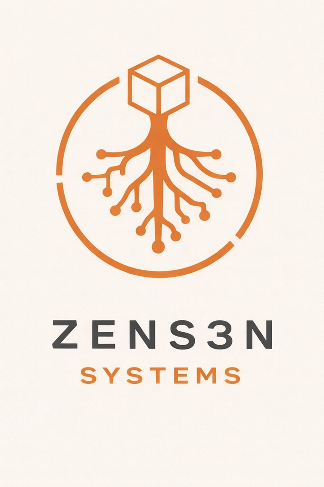

# ▛▞// Z E N S 3 N . S Y S ⫎ ▸ 



**AI systems, agents, and tools built for real work.**


---

## What is ZENS3N?

ZENS3N is a collection of production-ready AI systems, experimental agents, and reference documentation. Everything here is built to be **used**, not just admired.

**Start here:** [`3OX.Ai/3OX.BUILDER/`](3OX.Ai/3OX.BUILDER/) — Build and deploy AI agents with a single command.

---

## Structure

```
3OX.Ai/                 ← Start here: AI agent framework
└── 3OX.BUILDER/       ← Build and deploy agents

!ZEN.HUB/              ← Public showcase hub
├── COMPLETED.WORK/    ← Production-ready tools
├── LIBRARY/           ← Research, specs, HOWTOs
├── DOCS/              ← Internal documentation
└── ORIGINS/           ← The story behind ZENS3N

ZEN.LABS/              ← Experiments & prototypes
```

**Branches:**
- `branch/VPS` — VPS deployment infrastructure
- `branch/BASE` — Active development workspace

---

## Quick Start

### Try 3OX.BUILDER

The fastest way to build an AI agent:

```bash
git clone https://github.com/LLMasterDesign/ZENS3N.git
cd ZENS3N/3OX.Ai/3OX.BUILDER
bun run compile-run.bun
```

See [`START_HERE.md`](3OX.Ai/3OX.BUILDER/START_HERE.md) for full setup.

### Explore Completed Work

- **[BUDGET.BUILDER](!ZEN.HUB/COMPLETED.WORK/BUDGET.BUILDER/)** — Personal finance management agent
- **[CURSOR.CLEANER](!ZEN.HUB/COMPLETED.WORK/CURSOR.CLEANER/)** — System optimization toolkit

### Browse the Library

Research, specifications, and reference docs in [`!ZEN.HUB/LIBRARY/`](!ZEN.HUB/LIBRARY/).

---

## What's Inside

### 🚀 **3OX.Ai** — Agent Systems
Complete AI agent framework with boot loader, CLI, and setup tools. Build agents that work.

### ✅ **COMPLETED.WORK** — Production Tools
Finished projects ready to use. Each includes full documentation and examples.

### 📚 **LIBRARY** — Reference Materials
Specifications, lexicons, HOWTOs, and research you can learn from and build on.

### 🧪 **ZEN.LABS** — Experiments
Prototypes and early-stage projects open for feedback and collaboration.

---

## Repository

**Git Remote:** `git@github.com:LLMasterDesign/ZENS3N.git`

---

## Organization

- **3OX.Ai** — AI agent framework (start here)
- **!ZEN.HUB** — Public-facing hub (showcase, library, docs, origins)
- **ZEN.LABS** — Experimental projects
- **Branches:** `branch/VPS` (deployment), `branch/BASE` (development)

---

**Ready to build?** Start with [`3OX.BUILDER`](3OX.Ai/3OX.BUILDER/).
