# [1N]3OX Atlas

One map for the ZENS3N suite, public surfaces, runtime families, source
boundaries, and unresolved relationships.

## Authority map

| Authority | Owns | Does not own |
|---|---|---|
| `../suite-manifest.json` | 21-node suite graph, batches, ports, states, source bindings | explanatory architecture |
| `../` | executable website, satellite source, deployment verifiers | ecosystem-wide canon |
| `../../!WORKDESK/Projects/Atlas/` | public-site Looms, launch gates, rehearsals | suite-node graph |
| `../../ZEN.HUB/` | provider references, specs, patterns, runbooks | project implementation truth |
| `../../_TRON/` | runtime agents, services, stations, and system generation | public-site state |
| `../../../!7HE.BRIDGE/7HE.CITADEL/!CORE.MEM/` | durable contracts and canon | live provider state |
| Railway and public endpoints | current deployed behavior | design intent or local source truth |

Atlas binds these authorities. It does not replace them.

## Suite shape

```mermaid
flowchart TD
    SUITE[ZENSEN SYSTEM SUITE · 6060]

    SUITE --> ZS[ZENSEN SITES]
    SUITE --> OX[3OX]
    SUITE --> AG[ÆGEN]
    SUITE --> CT[CONTROL]
    SUITE --> SO[STRATA-OP]
    SUITE --> CO[CMD-OPS]

    ZS --> LIVE[zensen.live · 6061]
    ZS --> SOL[zensen.solutions · 6062]
    ZS --> SYS[zensen.systems · 6063]
    ZS --> STORE[zensen.store · 6064]
    ZS --> ENT[zensenenterprises.com · 6066]

    OX --> STUDIO[3ox.studio · 6050]
    OX --> AI[3ox.ai · 6051]
    OX --> OSTORE[3ox.store · 6052]

    AG --> AEGEN[ÆGen]
    AG --> AEGIS[ÆGIS]
    AG --> TAU[ÆGen τ]

    CT --> ORION[ORION]
    CT --> WARDEN[WARDEN]
    CT --> LEDGER[LEDG3R]

    SO --> ONE[1N3OX]
    SO --> ZENDEX[ZENDEX]
    SO --> WRKDSK[WRKDSK]

    CO --> CMD[CMD]
    CO --> TELE[TELEPROMPTR]
    CO --> ARGOS[ArgOS]
```



Every non-hub node currently points back to the suite through the Railway
private-network reference. That is a declared graph contract, not proof that
all nodes have deployed services.

## Batch register

| Batch | Nodes | System role | Current implementation state |
|---|---:|---|---|
| `SUITE` | 1 | suite edge and primary map | active staging |
| `ZENSEN-SITES` | 5 | public company surfaces | card-only |
| `3OX` | 3 | studio, AI, and store surfaces | studio active; two card-only |
| `ÆGEN` | 3 | runtime, governance, runtime receipt | card-only |
| `CONTROL` | 3 | supervision, policy gate, receipts | card-only |
| `STRATA-OP` | 3 | strata operations, index, workstation | card-only |
| `CMD-OPS` | 3 | command, teleprompt, governor | card-only |

## Node register

| Node | Batch | Role | Port | State | Source boundary |
|---|---|---|---:|---|---|
| `ZENSEN-SYSTEM-SUITE` | SUITE | suite-edge | 6060 | active-staging | repository root |
| `ZENSEN-LIVE` | ZENSEN-SITES | public-site | 6061 | card-only | unbound |
| `ZENSEN-SOLUTIONS` | ZENSEN-SITES | public-site | 6062 | card-only | unbound |
| `ZENSEN-SYSTEMS` | ZENSEN-SITES | public-site | 6063 | card-only | unbound |
| `ZENSEN-STORE` | ZENSEN-SITES | public-site | 6064 | card-only | unbound |
| `ZENSEN-ENTERPRISES` | ZENSEN-SITES | public-site | 6066 | card-only | unbound |
| `3OX-STUDIO` | 3OX | studio | 6050 | active-staging | `satellites/3ox.studio/` |
| `3OX.Ai` | 3OX | ai | 6051 | card-only | unbound |
| `3OX-STORE` | 3OX | store | 6052 | card-only | unbound |
| `ÆGen` | ÆGEN | runtime | — | card-only | unbound |
| `ÆGIS` | ÆGEN | governance | — | card-only | unbound |
| `ÆGen{τ}` | ÆGEN | runtime-receipt | — | card-only | unbound |
| `ORION` | CONTROL | supervision | — | card-only | unbound |
| `WARDEN` | CONTROL | policy-gate | — | card-only | unbound |
| `LEDG3R` | CONTROL | receipts | — | card-only | unbound |
| `1N3OX` | STRATA-OP | strata-ops | — | card-only | unbound |
| `ZENDEX` | STRATA-OP | index | — | card-only | unbound |
| `WRKDSK` | STRATA-OP | workstation | — | card-only | unbound |
| `CMD` | CMD-OPS | command | — | card-only | unbound |
| `TELEPROMPTR` | CMD-OPS | TELPROMPT | — | card-only | unbound |
| `ArgOS` | CMD-OPS | governor | — | card-only | unbound |

## Active surfaces

| Surface | Local | Tailscale | Railway | Public DNS |
|---|---|---|---|---|
| ZENSEN suite | `127.0.0.1:7120` | port `6060` | `zens3n-production.up.railway.app` | not approved |
| 3OX Studio | port `6050` | port `6050` | `3ox-studio-production.up.railway.app` | not purchased |

The manifest records declarations. Deployment verifiers and live requests prove
current behavior.

## Project boundaries

```text
ZENS3N repository
├── Atlas/                    mapping and thought surface
├── suite-manifest.json       authoritative 21-node graph
├── index.html                suite presentation
├── deploy/                   graph and surface verification
├── satellites/3ox.studio/    source-backed satellite
└── spec/                     product, market, valuation views

Workdesk Atlas
└── public-site Looms, launch gates, rehearsal, and promotion receipts

ZEN.HUB
└── external provider knowledge converted into reusable local contracts

_TRON + CORE.MEM
└── runtime implementation families and durable architectural authority
```

## Current gates

- Production DNS: not approved.
- Production VPS: not approved.
- 10,000-user capacity: not approved.
- Hosted suite and 3OX Studio are staging evidence only.
- Nineteen suite nodes remain card-only.
- Nineteen suite nodes have no source binding in the manifest.

## Mapping queue

1. Locate the strongest source for each unbound runtime node.
2. Classify every node as identity, product, service, agent, station, or control.
3. Draw authoritative event flow: request → authority → execution → receipt.
4. Bind each node to one source root without copying implementation into Atlas.
5. Separate the minimum launch suite from the hundred-year suite.
6. Reconcile local, Tailscale, Railway, and eventual public-domain routes.
7. Promote only proved relationships from inbox entries into this map.
